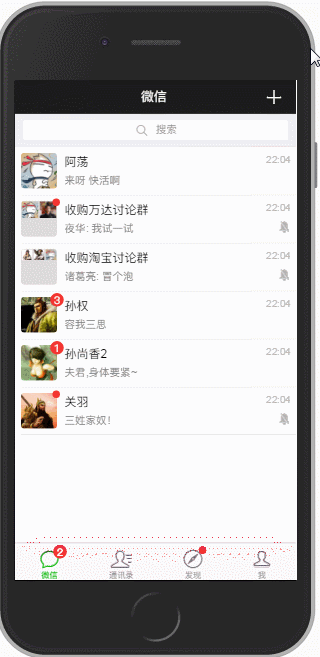
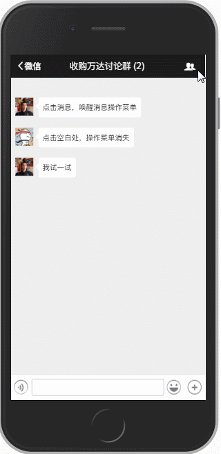

# 一款基于Vue2.0低仿微信App的单页应用
## 概述

利用Vue2.0模仿微信app，努力做到以假乱真的效果。个人独立开发，源码中有详细的注释，为新手提供许多有用的提示信息。项目的第一期接近尾声，后期会增加 **仿3DTouch**、**登陆**、**注册**、**emoji表情内嵌**、**通讯录检索**、~~**朋友圈图片预览**~~(已添加)等功能，让它更接近微信App的用户交互体验。

测试机为iPhone 6s，在微信内置浏览器以及Safari、Chrome浏览器中运行良好。

**微信列表的滑动交互**

**搜素组件的动画效果**

**进入对话框**

**对话框信息**

**首页Tab切换**

## 其他

* 适用于 Vue.2x 的图片预览插件
* 项目使用的webpack已更新到3.0版本，请安装webpack3.0，否则build失败
